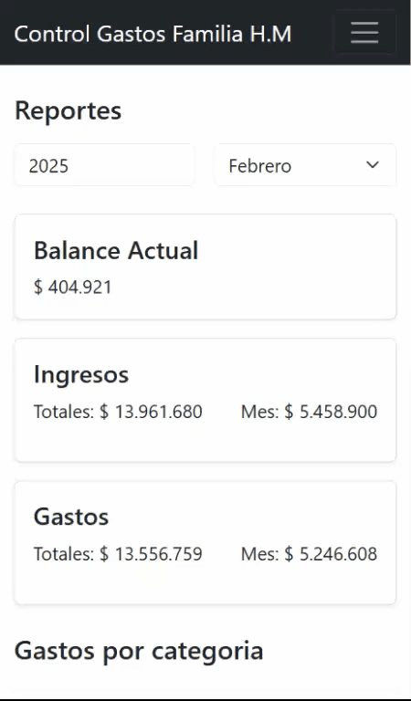

# 🏠 **Control de Gastos del Hogar**

Aplicación web para gestionar los ingresos y gastos de un hogar, con la posibilidad de generar reportes visuales tipo dashboard utilizando gráficos. El proyecto está desarrollado con **Express**, **Node.js**, **React + Vite**, **Chart.js** y usa **MongoDB** como base de datos.

## 🎬 Vista previa

### Dashboard de reportes


### CRUD de ingresos


### CRUD de gastos


## ⚙️ Tecnologías utilizadas

- **Backend**:
  - Node.js
  - Express.js
  - MongoDB (con Mongoose)
- **Frontend**:
  - React
  - Vite
  - Chart.js (para gráficos)
  
## 🧰 Instalación

1. Clona este repositorio:

```bash
git clone https://github.com/tuusuario/control-de-gastos.git
